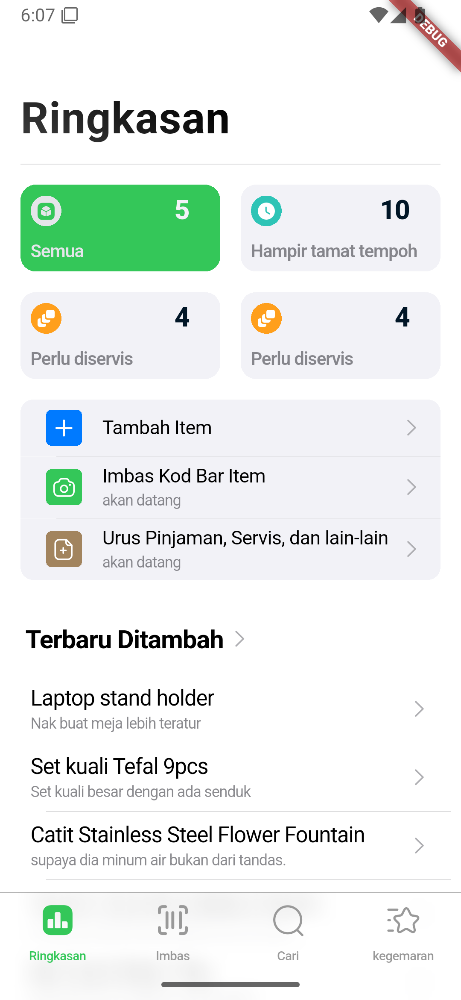
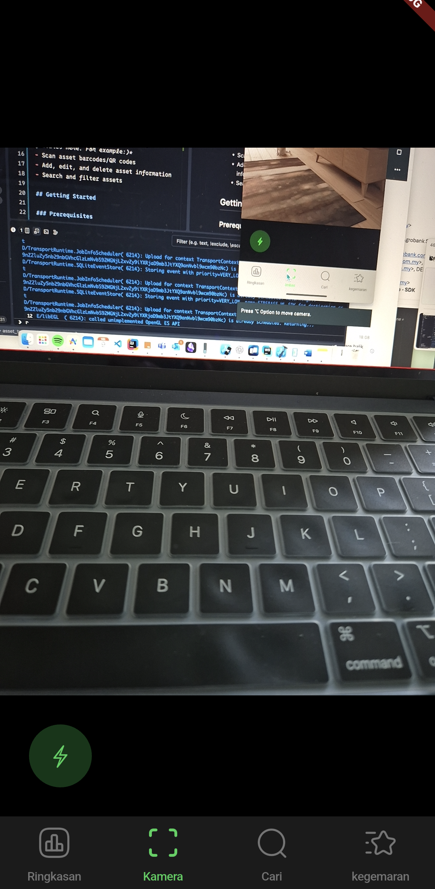
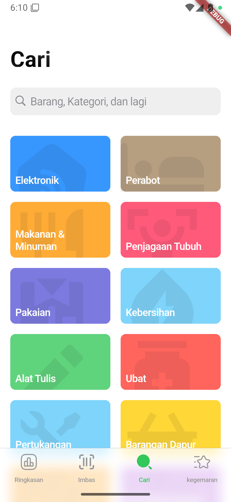

# Asset Tracker (ui)

A new Flutter project for tracking assets.

## Overview

This project is a Flutter application designed to help manage and track assets. 

### UI Showcase

|  |  |  |  |
|--------------------------------------------------|----------------------------------------------------------------|--------------------------------------------------|------------------------------------------------|


## Features

*(Add a list of your project's key features here. For example:)*
- Scan asset barcodes/QR codes
- Add, edit, and delete asset information
- Search and filter assets

## Getting Started

### Prerequisites

- Flutter SDK: Make sure you have Flutter installed. You can find installation instructions on the [official Flutter website](https://flutter.dev/docs/get-started/install).
- Supabase account: create a new supabase with the sql from `assets/sql_scripts/`


### Installation

1. Clone the repository:
   ```bash
   git clone https://github.com/zaiehilmi/asset_tracker
   ```
2. Go to your favorite IDE and run the project.
    > #### Using JetBrains IDE
    > directly open the project and run it when it done initializing
    > #### Using VSCode
    > go to Debug tab and run the project
